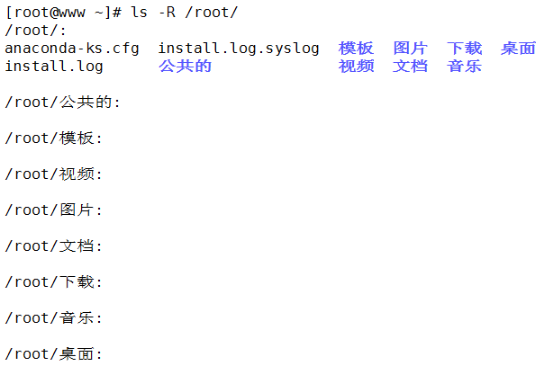


## **Linux系统管理01——系统命令精讲**
## **一、Linux命令的分类**
1、内部命令：属于Shell解释器的一部分

2、外部命令：独立于Shell解释器之外的程序

3、type命令，查看命令是外部命令还是内部命令：

 [root@www ~]# type cd

 cd is a shell builtin   【cd是一个内部命令】

 [root@www ~]# type ifconfig

 ifconfig is /sbin/ifconfig  【ifconfig是一个外部命令】
## **二、Linux命令格式**
1、Linux命令的通用格式：命令字  [选项]  [参数]

2、选项：用于调节命令的具体功能

 “-”引导短格式选项，例如“ls -a”

 “--”引导长格式选项，例如“ls --help”

 注意：多个短格式选项可以合并，例如“ls -alh”

 但是多个长格式选项，不能合并。

3、参数：命令的对象，如文件、目录名等

 例如：[root@www ~]# ls -alh /etc

 ls——命令字；-alh——选项；/etc——参数
## **三、命令快捷键**
  •  tab键：自动补齐文件名，命令等；按两次tab键，系统将输出可用的所有名称列表。

  •  反斜杠“\”:强行换行

  •  ctrl+U：快速删除光标之前所有字符（可视为剪切）

  •  ctrl+K：快速删除光标之后所有字符（可视为剪切）

  •  ctrl+Y：黏贴刚才所删除（剪切）的字符

  •  ctrl+L：清屏

  •  ctrl+C：取消当前命令行编辑；结束当前执行的命令

  •  ctrl+D：从shell提示中注销关闭，类似输入exit

  •  ctrl+A：把光标移动到行首，类似于Home键

  •  ctrl+E：把光标移动到行尾，类似于End键

  •  ctrl+Z：转入后台运行

  •  ctrl+R：在历史命令中查找（常用并且很好用）
## **四、帮助命令**
1、help内部命令帮助，查看bash内部命令的帮助

 用法1：help  内部命令字

 [root@www ~]# help cd

 用法2：命令字 --help

 即命令的“--help”选项，适用于大多数外部命令

 [root@www ~]# ls --help

2、man用来提供在线帮助，使用权限是所有用户。在Linux系统中存储着一部联机使用的手册，以供用户在终端上查找。使用man命令可以调阅其中的帮助信息，非常方便实用。

 （1）用法：man  命令字

 man [-acdfhkKtwW] [-m system] [-p string] [-C config\_file] [-Mpath] [-P pager] [-S 	section\_list][section] name ...

 （2）示例：

 [root@www ~]# man ls

 （3）参数

 -C config\_file：指定设定文件man.conf，缺省值是/etc/man.conf。

 [root@www ~]# man 1 man

 [root@www ~]# man 7 man

 （4）代号 代表內容

 1 使用者在shell中可以操作的指令或可执行档

 2 系統核心可呼叫的函数与工具等

 3 一些常用的函数(function)与函数库(library)，大部分是C的函数库(libc)

 4 装置档案的说明，通常在/dev下的档案

 5 设定档或者是某些档案的格式

 6 游戏(games)

 7 惯例与协定等，例如Linux档案系统、网络协定、ASCII code等等的說明

 8 系統管理員可用的管理指令

 9 跟kernel有关的文件

 （5）由于手册页man page是用less程序来看的(可以方便地使屏幕上翻和下翻), 所以 		 在man page里可以使用less的所有选项。
## **五、ls（list）命令详解**
1、作用：列表显示目录内的文件及目录，结合不同选项实现不同的作用。

2、格式：ls [选项] 目录或文件名

3、常用选项：

 -l：以长格式（long）显示文件和目录的列表

 -a：显示所有（all）子目录和文件的信息

 -A：与-a基本类似，但有两个特殊隐藏目录“.”和“..”不显示

 -d：显示目录（directory）本身的属性，常与-l同时使用

 -h：以更人性化（human）的方式显示出目录或文件的大小，常与-l同时使用

 -R：以递归（recursive）的方式显示目录及其子目录中的所有内容

4、示例：



## **六、du（disk usage）命令详解**
1、作用：用于统计制定目录或文件所占用磁盘空间的大小

2、格式：du [选项] 目录或文件名

3、常见选项：

 -a：统计磁盘空间占用时所有的文件，而不仅仅是统计目录

 -s：只统计所占用空间总的（summary）大小

4、示例：

 [root@www ~]# du -sh test/

 16K	test/
## **七、touch命令**
1、作用：创建空文件，用于测试。若当前文件已存在时，将更新该文件的时间戳

2、格式：touch 文件名

3、示例：


## **八、mkdir命令**
1、作用：创建新目录

2、格式：mkdir [选项] 目录位置及名称

3、常用选项：

 -p 一次性创建嵌套的多层目录

 -v 显示详细

 -m 跳出当前的umask值

4、示例：


## **九、cp（copy）命令**
1、作用：复制文件或目录

2、格式：cp [选项] 源文件或目录 目标文件或目录

3、常用选项：

 -f 覆盖同名文件或目录，强制（force）复制

 -i 提醒用户确认（interactive，交互式）

 -p 保持（preserve）源文件权限、属性、属主及时间标记等不变

 -r 递归（recursive）复制

4、示例：


## **十、rm（remove）命令**
1、作用：删除制定的文件或目录

2、格式：rm [选项] 要删除的文件或目录

3、常用选项：

 -f 不提示，直接强制删除

 -i 提示用户确认

 -r 递归式删除整个目录树

4、示例：

 [root@www /]# rm -rf test 【此命令危险，建议进入到文件夹后删除】

 建议如下操作：

 [root@www /]# cd test/

 [root@www test]# rm -rf \*
## **十一、mv（move）命令**
1、作用：将指定文件或目录转移位置（剪切），如果目标位置与源位置相同，则相当于执行重命名操作

2、格式：mv [选项] 源文件或目录 目标文件或目录

3、示例：


## **十二、which命令**
1、作用：查找Linux命令程序所在的位置

2、格式：which 命令|程序名

3、示例：

 [root@www ~]# which du

 /usr/bin/du

注意：默认当只熬到第一个目标后不再继续查找，若需查找全部，加选项-a。
## **十三、find命令**
1、作用：精细查找文件或目录

2、格式：find [查找范围] [查找条件表达式]

3、常用查找条件：
```
 -name 按名称查找	例：find /etc –name “resol\*.conf”

 -size 按大小查找		例：find /etc –size +1M 【k，M，G】

 -user 按属性查找		例：find /etc –user root

 -type 按类型查找		例：find /boot –type d 【d目录；f普通文件；b块设备；c字								符设备文件】
```
4、逻辑运算符
```shell

 （1）-a （and）逻辑“与”运算

 [root@www ~]# find /boot -size +1M -a -name "vm\*"

 /boot/vmlinuz-2.6.32-431.el6.x86\_64

 （2）-o （or）逻辑“或”运算

 [root@www ~]# find /boot -size +1M -o -name "vm\*"

 /boot/vmlinuz-2.6.32-431.el6.x86\_64

 /boot/initramfs-2.6.32-431.el6.x86\_64.img

 /boot/System.map-2.6.32-431.el6.x86\_64

```
